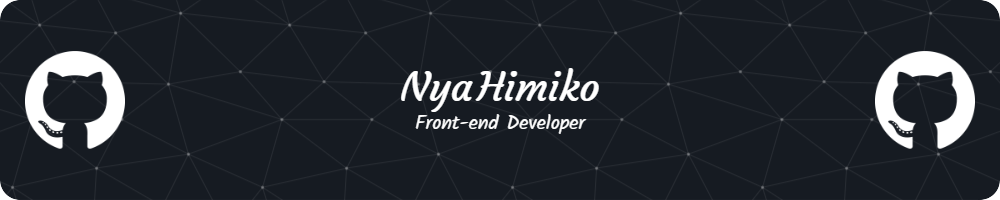

  
Hi! I'm Himiko! Welcome to my profile. I'm a freelance front-end developer from Vietnam. I like coding and playing games. I'm learning Python, C++, Java, React, Vue, and Tailwind CSS. I'm also learning graphic design and UI/UX design.

  <h2>GitHub Stats</h2>
  
  
  <h3>Connections</h3>
  
  
   
   
  

